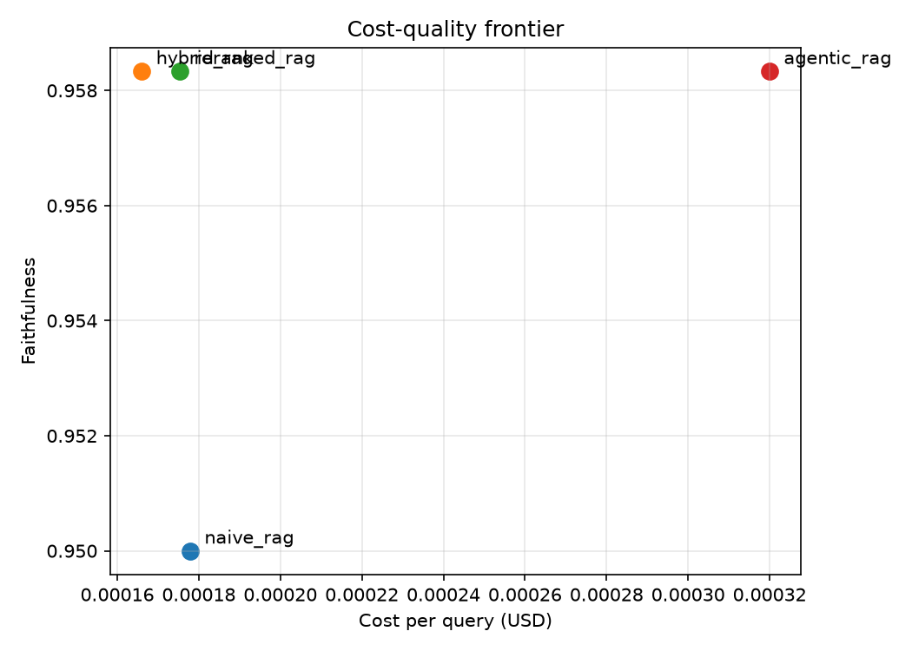

# RAGCheck Architecture Benchmark

Reproducible comparison of RAG retrieval architectures on a financial-filings corpus. Everything except the retrieval strategy is held constant: same chunking (1200 chars, 200 overlap), same embedding model (`all-MiniLM-L6-v2`), same generator model and prompt.

> **Status: preliminary results below (12 samples, free-tier run).** All 4 pipelines and the metric suite run end-to-end. The full run (300-500 samples) needs a funded API budget and will replace these numbers; at n=12, differences under ~0.2 are noise.

## Pipelines

| Pipeline | Retrieval |
|---|---|
| `naive_rag` | Dense (MiniLM cosine) top-5 |
| `hybrid_rag` | BM25 + dense top-20 each, reciprocal rank fusion (k=60), top-5 |
| `reranked_rag` | Dense top-20 → cross-encoder (`ms-marco-MiniLM-L-6-v2`) rerank → top-5 |
| `agentic_rag` | LLM query decomposition → iterative dense retrieval (max 3 rounds) → synthesis |

All four share the same chunking, embeddings, generator model, and generation prompt (which requires `[source_id]` citations) - the retrieval strategy is the only variable. Agentic's decomposition/sufficiency LLM calls are charged to its cost per query. Generator/judge models are selected with `RAGCHECK_BENCH_MODEL` / `RAGCHECK_JUDGE_MODEL`.

## Corpus

Latest 10-K filings of Apple, Microsoft, NVIDIA, Alphabet, Amazon, Meta, Tesla, and JPMorgan, fetched from SEC EDGAR and converted to plain text (~3.8 MB). Raw data is gitignored; the fetch script is deterministic.

## Reproduce

```bash
pip install -e ".[benchmarks]"
export GROQ_API_KEY=...
export RAGCHECK_BENCH_MODEL=meta-llama/llama-4-scout-17b-16e-instruct
python benchmarks/corpus/fetch_corpus.py                    # ~4 MB from EDGAR
ragcheck generate-dataset benchmarks/corpus/data --n 400 \
  --paraphrase-groups 20 --out benchmarks/synthetic_dataset.jsonl \
  --provider groq --model $RAGCHECK_BENCH_MODEL             # resumable
python benchmarks/run_benchmark.py                          # full; --quick for 20 samples
```

Outputs land in `benchmarks/results/`: per-pipeline JSON reports, `comparison.json`/`comparison.md`, and `cost_quality_frontier.png` (cost/query vs. faithfulness). `--pipelines`, `--metrics`, and `--n` subset a run for cheap smoke tests.

## Preliminary results (4 pipelines, 12 stratified samples, 2026-07-06)

Generator + judge: `meta-llama/llama-4-scout-17b-16e-instruct`. Samples include 2 unanswerable questions and one full paraphrase group. Chunk-level judged metrics (context precision/recall, citation accuracy) were excluded from this budget-constrained run.

| Pipeline | hit_rate@5 | mrr | faithfulness | answer_relevance | refusal_calibration | paraphrase_consistency | tok/q | $/q | retrieval p50 |
|---|---:|---:|---:|---:|---:|---:|---:|---:|---:|
| naive_rag | 0.500 | 0.450 | 0.950 | 0.917 | 0.583 | 0.700 | 1535 | $0.00018 | 43 ms |
| hybrid_rag | 0.400 | 0.245 | 0.958 | 0.938 | 0.500 | **1.000** | 1448 | $0.00017 | 75 ms |
| reranked_rag | 0.500 | 0.183 | 0.958 | 0.917 | 0.500 | **1.000** | 1511 | $0.00018 | 359 ms |
| agentic_rag | 0.500 | 0.450 | 0.958 | 0.854 | **0.750** | 0.450 | 2683 | $0.00032 | 6602 ms |



**Preliminary reads (all within noise at this sample size, offered as hypotheses for the full run):**
- **Agentic RAG is the refusal-calibration leader but the consistency laggard** - its multi-round retrieval gathers enough to decline unanswerables more often (0.75 vs 0.50-0.58), but different decompositions per paraphrase produce different answers (0.45 consistency). It also costs 1.75x tokens/query and ~90x retrieval latency.
- **Hybrid and reranked are perfectly paraphrase-consistent** on this subset - stabler retrieval under rephrasing.
- **Faithfulness is uniformly high (~0.95)** across architectures: the shared generator rarely asserts beyond its context; retrieval quality, robustness, and cost are where architectures actually differ.

## Early results (2 pipelines, 16 samples, 2026-07-02)

| Pipeline | hit_rate@5 | faithfulness | tokens/query | retrieval p50 (ms) |
|---|---:|---:|---:|---:|
| `naive_rag` (dense) | 0.438 | 1.000 | 1666 | 40 |
| `hybrid_rag` (BM25 + dense, RRF) | **0.750** | 0.948 | 1555 | 47 |

**Read:** on 10-K filings — dense-heavy with exact figures, entity names, and legal terms — adding BM25 lexical matching via reciprocal rank fusion lifts hit_rate@5 from 0.44 to 0.75 for ~7 ms extra retrieval latency. Both pipelines stay highly faithful *to what they retrieve*; the naive pipeline's perfect faithfulness with poor retrieval illustrates why retrieval and generation metrics must be read together (a pipeline can faithfully report that the answer isn't in its badly-retrieved context).

## Honest limitations

- **Small sample (16).** Differences of a few points are noise at this size.
- **QA pairs are single-chunk and auto-generated.** Each question is grounded in exactly one chunk, and `hit_rate` counts only that chunk as relevant - a retrieved *duplicate* passage with the same fact counts as a miss. Some generated questions lean on filing boilerplate rather than substantive financials.
- **No judge validation yet.** Faithfulness scores come from an unvalidated LLM judge; the judge-vs-human agreement module is Phase 2.
- **Corpus text extraction is rough.** HTML tables flatten into text streams; some chunks are noisy.
- **10-K filings shift over time.** The fetch script pulls each company's *latest* 10-K, so exact numbers will drift as new filings land; re-generate the dataset after re-fetching.
